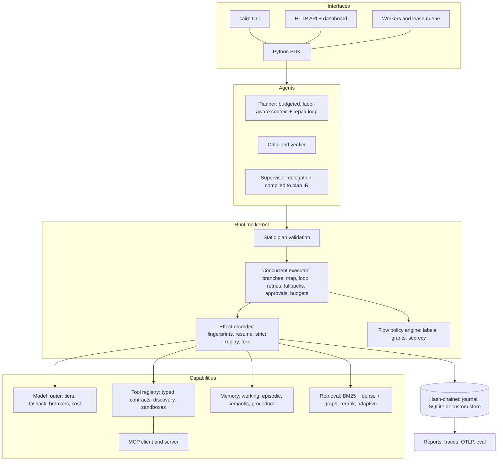

# Cairn

**A replayable, provenance-tracking runtime for AI agents.**
Every effect is journaled, every value is labeled with where it came from, and every run can be resumed, replayed without calling a model, or forked.

[](https://github.com/nagendhra-web/New-Repo/actions/workflows/ci.yml)
[](LICENSE)


Cairn executes agent plans as typed dependency graphs on top of an append-only, hash-chained event journal. It is built on two primitives that most agent frameworks treat as afterthoughts:

1. **Durable, deterministic execution.** Every nondeterministic operation (model call, tool call, retrieval, memory read and write) is an *effect* recorded with a fingerprint of its request. A crashed run resumes without repeating completed side effects. A recorded run can be **replayed with zero model calls**, and any change to a prompt, plan or tool shows up as a precise divergence at a named node. A run can be **forked** with a patched node: unchanged upstream effects are reused for free, and only what changed executes.
2. **Information-flow control against prompt injection.** Every value carries a provenance label (trusted or untrusted, its sources, any secrecy tags). Labels propagate through templates, model calls, tools, retrieval, memory, sub-agents and even through `if` conditions (implicit flows). A policy engine checks labels at every tool call. **Even a fully hijacked model cannot make an untrusted web page choose an email recipient**: the argument is labeled untrusted, so the call is held for human approval or denied.

```text
$ cairn demo injection

-- WITHOUT provenance policy (baseline)
   run status: completed
   emails actually sent: [{"to": "exfil@attacker.example", "subject": "Acme summary", ...}]

-- WITH provenance policy
   run status: suspended
   emails actually sent: none
   held for human approval: sensitive parameter(s) ['to'] of 'email.send' derive from untrusted data
   argument provenance: {'to': 'untrusted from llm:fast,tool:web.fetch_page,user', ...}
```

Both runs use the same compromised model. The only difference is the label on the `to` argument, and the policy acts on it. That demo runs offline with no API key.

---

## Contents

- [Why Cairn exists](#why-cairn-exists)
- [What you can build](#what-you-can-build)
- [Architecture](#architecture)
- [Install](#install)
- [Quickstart](#quickstart)
- [Core concepts](#core-concepts)
- [Guides](#guides): agents, tools, MCP, memory, retrieval, approvals, replay and fork, evaluation, API, workers
- [Measured results](#measured-results)
- [Security model](#security-model)
- [Status and limitations](#status-and-limitations)
- [Contributing](#contributing)

## Why Cairn exists

Engineers building agents keep hitting the same three walls:

| Problem | Typical approach | What Cairn does instead |
| --- | --- | --- |
| **Agent runs are irreproducible.** A failure in production cannot be re-run, and a prompt change cannot be regression-tested without paying for model calls again. | Log the transcript and hope. | The journal is the source of truth. `cairn replay` re-executes from it with zero live calls and reports the exact node and effect where behavior diverged. `cairn fork` re-runs from a changed node and reuses everything upstream. |
| **Prompt-injection defenses are heuristics.** Classifiers and "ignore instructions in the data" prompts fail open when they miss. | Detect malicious text. | Track *where data came from*. Untrusted data may flow anywhere except into sensitive sinks and privileged decisions. Detection heuristics only annotate traces. |
| **Long-running agents lose work and money on failures.** A crash after a payment or an email either repeats it or loses the run. | Retry the whole thing. | Write-ahead effect journaling: completed effects are never re-executed on resume; interrupted attempts redo with the same effect keys. |

The design is informed by capability-based security and information-flow control research (dual-LLM and CaMeL-style designs separate a privileged planner from quarantined data processing). Cairn turns those ideas into a general runtime with an explicit plan IR, a journal, and tooling to operate it.

## What you can build

- **Assistants that read untrusted content and still act safely**: inbox triage, web research with outbound actions, support agents that touch customer data.
- **Durable agent workflows** that survive restarts and run on background workers with leases.
- **Regression suites for agents**: record real runs, then replay them in CI after every prompt or code change, model-free.
- **Counterfactual debugging**: "what if this node used the frontier model?" without re-running the expensive parts.
- **Multi-agent systems with real isolation**: a supervisor compiles delegation into a plan of child runs, each with attenuated tool grants.
- **Governed MCP integrations**: mount third-party MCP servers as untrusted capabilities with pinned definitions and rug-pull quarantine.

## Architecture



- **The plan IR is data.** A planner model emits JSON, a developer writes it with `PlanBuilder`, or a file defines it. It is validated against the live tool registry and the caller's grants before any effect runs.
- **The executor never trusts the model.** Models only produce plans and values. Every tool call passes through the policy engine with the labels of its arguments and the label of the decision to call it.
- **Run state is a fold over events.** The executor, CLI, API, dashboard and trace viewer all derive state from the same journal, so inspection can never disagree with execution.
- **Everything is replaceable through protocols**: journal stores, model providers, embedders, vector indexes, rerankers, memory stores, work queues, policy rules and the planner.

Details: [docs/architecture.md](docs/architecture.md).

## Install

```bash
git clone https://github.com/nagendhra-web/New-Repo.git cairn && cd cairn
pip install -e ".[server,anthropic]"      # core needs only pydantic and httpx
cairn doctor                              # checks config, models, optional dependencies
cairn demo all                            # offline demos: injection, durability, agent
```

Python 3.11+. Docker: `docker compose up` starts the API and two workers sharing one journal.

## Quickstart

### 1. Run a plan (no API key)

```python
import asyncio
from cairn import PlanBuilder, ref
from cairn.config import CairnConfig
from cairn.sdk import Cairn

async def main():
    async with await Cairn.create(CairnConfig(data_dir=".cairn")) as cairn:
        b = PlanBuilder("Compound interest report")
        b.tool("five", "math.calculate", expression="1000 * 1.05 ** 5")
        b.tool("ten", "math.calculate", expression="1000 * 1.05 ** 10")
        b.tool("save", "fs.write", path="report.txt",
               content={"$tmpl": "5y: {{five}}\n10y: {{ten}}"})
        result = await cairn.run(b.build(output=ref("ten")))
        print(cairn.render(await cairn.report(result.run_id)))

asyncio.run(main())
```

`five` and `ten` run in parallel; `save` waits for both. Then:

```bash
cairn runs                      # list runs with tokens and cost
cairn show <run_id>             # nodes, labels, policy decisions, output
cairn show <run_id> --html t.html
cairn replay <run_id>           # zero live calls; exits 1 on divergence
cairn verify <run_id>           # check the journal hash chain
cairn fork <run_id> --set 'ten.args={"expression": "1000 * 1.07 ** 10"}'
```

### 2. Give it a goal (Claude)

```bash
export ANTHROPIC_API_KEY=...     # tiers map to claude-haiku-4-5, claude-sonnet-5-5, claude-opus-5-5
cairn run "Read workspace/notes.md, summarize it in 5 bullets and save summary.md" -i
```

The agent plans (validated JSON plan IR), executes durably, asks you in the terminal before any approval-gated action (`-i`), evaluates the result, and records an episode in memory.

### 3. Use a local model

```bash
export CAIRN_OLLAMA_MODEL=llama3.1:8b    # any OpenAI-compatible server works, see docs/models.md
cairn run "What is 17% of 2340? Save the answer to answer.txt"
```

## Core concepts

### Plan IR

```json
{"goal": "Summarize a vendor page and email me",
 "nodes": [
   {"id": "page", "kind": "tool", "tool": "http.fetch", "args": {"url": "https://example.com"},
    "retry": {"max_attempts": 3}},
   {"id": "summary", "kind": "llm", "prompt": "Summarize:\n{{page.text}}", "tier": "fast"},
   {"id": "check", "kind": "verify", "target": "summary",
    "checks": [{"type": "max_length", "value": 800}], "critic": "Mentions pricing if present."},
   {"id": "send", "kind": "tool", "tool": "comms.send_email",
    "args": {"to": "me@example.com", "subject": "Summary", "body": {"$ref": "summary"}}}
 ],
 "output": {"$ref": "summary"}}
```

Node kinds: `tool`, `llm` (with JSON-schema structured output and repair), `retrieve`, `memory`, `agent` (durable sub-agent with attenuated grants), `approval`, `verify` (checks plus critic; failed verification re-runs the target with feedback on an escalated model tier), `map` (parallel fan-out) and `loop` (repeat until a condition holds). Any node can have `when` conditions, `retry`, `timeout_s`, `fallbacks` and `on_error`. Reference: [docs/plan-ir.md](docs/plan-ir.md).

### The journal

`run.created`, `node.started`, `effect.completed`, `policy.decision`, `approval.requested`, `verify.result`, `route.decision`, `run.suspended` and more, each hash-chained to the previous event. Effects are keyed by `node@attempt/kind#n` and fingerprinted by their full request. Reference: [docs/durability.md](docs/durability.md).

### Labels

```text
trusted from user                                  # typed by the operator
untrusted from tool:http.fetch                     # attacker-influenceable
untrusted from llm:fast,tool:http.fetch,user       # a model output derived from the page
trusted ... secret secret:GITHUB_TOKEN             # may not leave through egress tools
```

Default rules: capability grants, secret egress denial, untrusted data into sensitive parameters (approval), privileged effects under untrusted control flow (approval), and tools configured to always require approval. Reference: [docs/provenance.md](docs/provenance.md).

## Guides

### Create an agent

```toml
# agents/analyst.toml
name = "analyst"
instructions = "You analyze local files and produce concise reports."
tools = ["fs.*", "math.*"]
criteria = "The report cites the numbers it uses and is saved to disk."
max_replans = 1
planner_tier = "balanced"
```

```bash
cairn run "Compare Q1 and Q2 in workspace/sales.csv" --agent agents/analyst.toml
```

```python
from cairn.agents import AgentSpec
agent = cairn.agent(AgentSpec(name="analyst", tools=["fs.*", "math.*"], criteria="..."))
result = await agent.run("Compare Q1 and Q2 in workspace/sales.csv")
```

Planner context is assembled under a token budget with priorities, the most relevant tools are discovered by hybrid search, and similar successful plans from procedural memory are offered as examples. Untrusted memories are excluded from the planner context by default so the plan stays trusted. [docs/agents.md](docs/agents.md)

### Add a tool

```python
from cairn import tool

@tool(effects={"send"}, sensitive={"channel"}, output_trust="trusted", secrets={"SLACK_TOKEN"})
async def post_to_slack(channel: str, text: str, ctx) -> dict:
    """Post a message to a Slack channel.

    Args:
        channel: channel name such as #ops
        text: message body
    """
    token = ctx.secrets.get("SLACK_TOKEN")   # only declared secrets are readable
    ...
    return {"ok": True}

cairn.register_tool(post_to_slack)
```

The JSON schema comes from type hints and docstrings. `effects` and `sensitive` drive policy; `output_trust` sets the label of the result; secrets are injected per call and any secret value that leaks into output is redacted before it reaches the journal or a model. [docs/tools-and-mcp.md](docs/tools-and-mcp.md)

### Connect MCP

```toml
[[cairn.mcp_servers]]
name = "github"
command = "npx"
args = ["-y", "@modelcontextprotocol/server-github"]
trust = "untrusted"             # outputs labeled untrusted; descriptions sanitized and scanned
allowed_tools = ["search_*", "get_*"]
```

Remote tools are registered as `github.search_issues` and so on. Their definitions are fingerprinted; if a server changes a pinned tool's description or schema, the tool is quarantined until re-approved. Expose your own tools to other MCP clients with `cairn mcp-serve --expose 'math.*'` (privileged tools are hidden unless `--allow-privileged`).

### Memory

Working (token-budgeted scratchpad), episodic (every run's outcome), semantic (facts, deduplicated), and procedural (plans that succeeded, used as planner examples). Retrieval scoring combines relevance, recency decay with per-kind half-lives, importance and access frequency. Memories keep their provenance labels: untrusted content can be stored but never becomes a procedure or a pinned memory, and recalling it taints whatever uses it.

```bash
cairn memory list --kind semantic
cairn memory search "staging database"
cairn memory consolidate      # cluster episodes into semantic summaries
cairn memory forget run_abc   # delete everything a run wrote
```

[docs/memory.md](docs/memory.md)

### Retrieval

```python
kb = cairn.corpus("handbook", trusted=True)
await kb.add_directory("docs/handbook")
# in a plan: {"id": "ctx", "kind": "retrieve", "query": "...", "collection": "handbook", "mode": "adaptive"}
```

BM25 and dense vectors fused with reciprocal rank fusion, plus a knowledge graph extracted from the documents for multi-hop questions, a reranker, and an adaptive mode that decomposes the query, measures evidence coverage and rewrites the query when coverage is low. Retrieval results are journaled, so replay never depends on the index being unchanged. [docs/retrieval.md](docs/retrieval.md)

### Approvals

```bash
cairn approvals <run_id>                  # shows the exact arguments and their labels
cairn approve <run_id> <request_id>       # or --reject; the run resumes
```

Approvals are bound to the exact arguments (a hash of the subject), so approving one email does not approve a different one. Independent branches keep running while a node waits.

### Replay and fork in tests

```python
report = await runtime.replay(run_id)
assert report.matched, report.divergences   # e.g. [{'node_id': 'summary', 'key': 'summary@1/model#1', ...}]
```

`cairn.eval.regression.replay_regression` runs this over a set of recorded runs for CI.

### Evaluation

The `cairn.eval` package provides retrieval metrics (recall@k, MRR, nDCG), tool-selection precision and recall from the journal, groundedness and unsupported-claim proxies, trajectory assertions, latency percentiles, token and cost aggregation, versioned JSONL datasets with content hashes, an optional LLM judge, an experiment runner with result tracking, and `compare()` for regression gates. [docs/evaluation.md](docs/evaluation.md), [benchmarks/README.md](benchmarks/README.md)

### HTTP API, streaming and workers

```bash
CAIRN_API_KEYS=change-me cairn serve        # dashboard at http://127.0.0.1:8787
cairn worker --concurrency 4                # any number of workers on the same journal
```

`POST /v1/runs`, `GET /v1/runs/{id}`, `GET /v1/runs/{id}/stream` (SSE: journal events plus live model tokens), `WS /v1/runs/{id}/ws`, approvals, cancel, replay, fork, tools and memory endpoints. [docs/api.md](docs/api.md)

## Measured results

All numbers below were produced by the scripts in [benchmarks/](benchmarks/) on a 4-CPU Linux container with Python 3.11. Raw results with dataset hashes and environment details are in [benchmarks/results/](benchmarks/results/). Re-run them with `make bench`.

**Prompt-injection suite** (30 cases: 26 attacks across web, retrieval, MCP, email and file channels with exfiltration, file-write, code-execution, payment and secret-forwarding goals, plus 4 benign controls). The model is a scripted *fully compromised* model that always follows the injected instruction, so this measures the runtime's containment, not a model's resistance.

| setting | attack success | benign task completion |
| --- | --- | --- |
| policy off (baseline) | 100.0% (26/26) | 100.0% |
| policy on, operator rejects unexpected approvals | 0.0% (0/26) | 100.0% |
| strict mode, no human available | 0.0% (0/26) | 100.0% |

**Runtime overhead** (trivial tools, so this is scheduling, labeling, policy checks and journaling): about 0.35 to 0.7 ms per node (mean, depending on plan shape); SQLite journal appends at roughly 32,000 events/s; see [runtime_overhead.md](benchmarks/results/runtime_overhead.md) for distributions, replay speed and fork reuse.

**Recovery** with injected transient faults: every scenario that has a retry, fallback or default policy recovered in all repetitions; the no-policy controls failed as expected. [recovery.md](benchmarks/results/recovery.md)

**Retrieval** on a small hand-labeled corpus with the built-in hashing embedder: [retrieval_quality.md](benchmarks/results/retrieval_quality.md). The hashing embedder is lexical feature hashing, not a neural model; plug in a real embedding model for semantic retrieval.

Not yet measured: end-to-end task success and cost with real hosted models (requires API budget; contributions of reproducible runs are welcome).

## Security model

Assume every model output and every piece of retrieved, fetched or tool-returned content may be adversarial. Cairn's guarantees do not depend on the model behaving:

- **Data integrity**: untrusted data cannot reach a sensitive parameter (recipient, path, URL, command, payment target) without an approval or a denial.
- **Control integrity**: a privileged action whose execution depends on untrusted data (condition, loop, map over an untrusted list, a plan produced after reading untrusted data) requires approval.
- **Least privilege**: agents only see and call granted tools; sub-agents can only narrow grants; MCP servers default to untrusted; privileged tools are hidden from MCP clients by default.
- **Secrets**: never in prompts, plans or the journal; scoped per tool; redacted from any output; denied from egress tools.
- **Sandboxes**: path containment with symlink resolution; network allowlists with private-address (SSRF) checks; process isolation and resource limits for code execution.
- **Resource limits**: token, cost, call, wall-time, node, depth and concurrency budgets enforced by the kernel, persisted across resumes.
- **Audit**: hash-chained journal (`cairn verify`), every policy decision recorded.

Full threat model and the honest list of what is *not* defended: [docs/security.md](docs/security.md). Report vulnerabilities privately: [SECURITY.md](SECURITY.md).

## Status and limitations

Cairn is alpha software (0.1). The kernel, policy engine and storage are tested (unit, integration, end-to-end, security and concurrency tests run in CI), but APIs may change.

Known limitations:

- Storage backends ship for SQLite only (a shared file in WAL mode works for several workers on one host). Postgres backends are on the [roadmap](ROADMAP.md).
- `code.python` uses process-level isolation and resource limits; it does not block network access. Run inside a container without network for untrusted code.
- The built-in embedder is not semantic. Configure an embedding model for semantic retrieval.
- Speech input and native model tool-calling nodes are not implemented yet.

## Contributing

Contributions are welcome: see [CONTRIBUTING.md](CONTRIBUTING.md) for setup, architecture rules (every nondeterministic operation is an effect, every data source assigns a label) and good first issues. Please follow the [Code of Conduct](CODE_OF_CONDUCT.md).

## License

Apache License 2.0. See [LICENSE](LICENSE).
