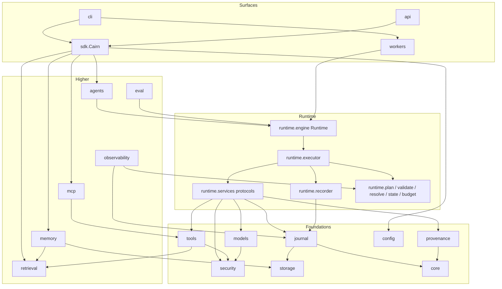
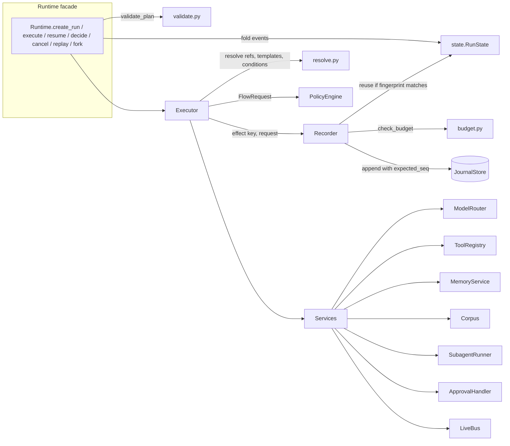

# Architecture

Cairn is a Python runtime that executes agent plans as durable, journaled runs. A plan is a typed graph (the Plan IR, see [plan-ir.md](plan-ir.md)); the executor runs it node by node, routes every nondeterministic effect (model call, tool call, retrieval, memory operation, sub-agent) through a single recorder that writes an append-only, hash-chained journal, and checks every tool call against a provenance policy before it executes.

This page describes the layers, which layer may depend on which, the lifecycle of a request through `Cairn.ask`, and the extension points.

## Layers

| Layer | Package | Responsibility |
|---|---|---|
| core | `cairn.core` | Ids (`new_id`), canonical JSON and hashing (`canonical_json`, `stable_hash`), the error hierarchy (`CairnError` and subclasses, each with a stable `code` and a `retryable` flag), clocks (`SystemClock`, `ManualClock`). |
| provenance | `cairn.provenance` | `Label` (integrity, sources, secrecy), `Labeled` values, the flow `PolicyEngine` and its default rules. |
| storage | `cairn.storage` | `SQLiteDatabase`: one connection, WAL mode for file databases, namespaced ordered migrations shared by the journal, memory and queue. |
| journal | `cairn.journal` | `Event`/`EventDraft`, `EventType`, the hash chain (`verify_chain`), the `JournalStore` protocol with `InMemoryJournal` and `SQLiteJournal`, optimistic-concurrency appends. |
| runtime | `cairn.runtime` | Plan IR (`plan.py`), static validation (`validate.py`), reference and template resolution (`resolve.py`), run state as a fold over events (`state.py`), the recorder (`recorder.py`), budgets (`budget.py`), the executor (`executor.py`), the `Runtime` facade (`engine.py`) and the `Services` container plus protocols (`services.py`). |
| models | `cairn.models` | Provider-neutral request/response types, `Tier`, providers (`AnthropicProvider`, `OpenAICompatibleProvider`, `ScriptedProvider`), the `ModelRouter`, structured-output parsing and validation. |
| tools | `cairn.tools` | `ToolSpec`, the `@tool` decorator, `ToolRegistry` (discovery, quarantine, validated invocation), built-in tools. |
| mcp | `cairn.mcp` | JSON-RPC framing, an MCP stdio client, the bridge that mounts MCP servers into a `ToolRegistry`, and an MCP server that exposes a registry. |
| memory | `cairn.memory` | `MemoryManager` (multi-layer memory with provenance write policy, decay, dedup, consolidation), stores, working memory. |
| retrieval | `cairn.retrieval` | Chunking, BM25, embedders, vector index, hybrid RRF, knowledge graph, rerankers, `DocumentCorpus`, `AdaptiveRetriever`. |
| agents | `cairn.agents` | `Planner`, `ContextBuilder`, `Critic`, `Agent`, `AgentSubagentRunner`, `Supervisor`. |
| eval | `cairn.eval` | Metrics, trajectories, datasets, LLM judge, `EvalRunner`, replay-based regression. |
| observability | `cairn.observability` | Run reports, span trees, OTLP/JSON export, text and HTML renderers, logging configuration. |
| security | `cairn.security` | `SecretVault`/`SecretScope`/`Redactor`, `PathSandbox`, `NetworkPolicy`, `safe_env`, rate limiters and circuit breaker, injection heuristics. |
| config | `cairn.config` | `CairnConfig` and friends, `load_config`, `auto_models`. |
| sdk | `cairn.sdk` | `Cairn`: wires configuration into a working runtime; `build_router`. |
| api | `cairn.api` | FastAPI app (`create_app`) with runs, streams, approvals, replay/fork, tools and memory endpoints, plus a static dashboard. |
| workers | `cairn.workers` | `SQLiteWorkQueue` (leased jobs), `Worker`, `submit_run`, `resume_when_approved`. |
| cli | `cairn.cli` | The `cairn` command. |

## Dependency direction

Lower layers never import higher ones. The executor depends only on protocols in `runtime/services.py` for memory, corpora and sub-agents, so it does not import `cairn.memory`, `cairn.retrieval` or `cairn.agents`.



Notes on edges that look surprising:

* `tools` imports `retrieval.index.HybridIndex` because `ToolRegistry.discover` ranks tools with the same hybrid index used for documents and memory.
* `models.router` imports `security.ratelimit` for `TokenBucket` and `CircuitBreaker`.
* `observability` imports `runtime.state.fold` so reports are projections of the same fold the executor uses.
* `runtime.validate` imports `tools.registry` to check tool names and argument names.

## Runtime components



* **Runtime state is a pure fold.** `state.fold(run_id, events)` rebuilds `RunState` (plan, node states, effect records, approvals, usage, output) from journal events. The executor, CLI, API and trace builder all use it.
* **The recorder is the single choke point for nondeterminism.** `Recorder.effect(key, kind, request, run)` either reuses a recorded result whose request fingerprint matches, or checks the budget, runs the effect live, and journals the result before returning it. See [durability.md](durability.md).
* **The executor is a scheduler plus node drivers.** Ready nodes run concurrently up to `budget.max_concurrency`. Each node goes through `when` evaluation, retries, fallbacks and its `on_error` policy. Tool calls go through the policy engine first.

## Request lifecycle of `Cairn.ask`

`Cairn.ask(goal)` calls `self._require_models()` and then `self.agent().run(goal)`. `Cairn.agent()` builds an `AgentSpec(name="cairn", tools=config.tools, budget=config.budget.model_dump())`.

```mermaid
sequenceDiagram
    autonumber
    participant U as Caller
    participant C as Cairn
    participant A as Agent
    participant M as MemoryManager
    participant PL as Planner
    participant RT as ModelRouter
    participant R as Runtime
    participant X as Executor
    participant PE as PolicyEngine
    participant RC as Recorder
    participant J as Journal
    participant CR as Critic

    U->>C: ask(goal)
    C->>A: agent().run(goal)
    A->>M: find_procedures(goal, 2), recall(goal, "semantic", 5)
    M-->>A: sections with labels
    A->>PL: plan(goal, grants, extra_sections, isolate_untrusted)
    PL->>PL: ContextBuilder.build() (drop untrusted sections, compress)
    PL->>RT: complete(PLAN_FORMAT system + context + goal)
    RT-->>PL: JSON plan text
    PL->>PL: extract_json, Plan.model_validate, validate_plan (repair up to 2 times)
    PL-->>A: PlanningResult(plan, label = USER join context label)
    A->>R: create_run(plan, grants, label, budget, extra={planning})
    R->>R: validate_plan again
    R->>J: append run.created (expected_seq=1)
    A->>R: execute(run_id)
    R->>J: read events, fold to RunState
    R->>X: Executor(services, Recorder(state)).run()
    X->>RC: emit run.started
    loop each ready node (concurrent up to max_concurrency)
        X->>RC: emit node.started (attempt, strategy, control)
        X->>X: resolve args (labels joined)
        X->>PE: evaluate(FlowRequest) for tool calls
        X->>RC: emit policy.decision
        alt deny
            X->>RC: node fails (non-retryable PolicyViolation)
        else require_approval
            X->>RC: emit approval.requested, node.waiting
        else allow
            X->>RC: effect(key, kind, request, run)
            RC->>J: append effect.completed or effect.failed
            X->>RC: emit node.completed (output, label, control)
        end
    end
    X->>RC: emit run.completed / run.suspended / run.failed
    R-->>A: RunResult
    alt completed and spec.criteria set
        A->>CR: evaluate(goal, output, criteria, trusted)
        CR-->>A: Verdict (replan with feedback if not passed)
    end
    A->>M: record_episode(...); save_procedure(...) only if plan label trusted
    A-->>C: AgentResult
    C-->>U: AgentResult(status, output, run_ids, label, verdict, ...)
```

Points worth knowing:

* The planner calls the router directly, before the run exists, so its calls are not journaled as individual effects. Their usage is stored in the `run.created` event under `planning` (`attempts`, `usage`, `context`, `repairs`), and folding that event charges it to the run: `Usage.add_planning` adds the planner's calls, tokens and cost to `RunState.usage`, recorded under `by_model["planner"]`. Planning therefore counts toward the run's token, model-call and cost budgets for every later effect, and appears in run reports. The critic (`Critic.evaluate`) and the supervisor's delegation call also go directly to the router; they are not charged to a run. Replaying a run re-executes its recorded plan; it does not re-plan.
* The run goal recorded in the journal is the plan's `goal` field. The planner keeps a `goal` the model emits and only fills it in when missing (`data.setdefault("goal", goal)`), so the run goal can differ from the text passed to `ask`.
* If the run suspends for approval, `Agent.run` returns an `AgentResult` with `status="suspended"`; `Agent.resume(run_id)` continues later.
* If the run fails or the critic rejects it, the agent replans with feedback, up to `AgentSpec.max_replans` (default 1). Each attempt is a separate run; `AgentResult.run_ids` lists them.

## Extension points

All extension points are protocols or plain callables; nothing requires subclassing.

| Extension point | Where | Contract |
|---|---|---|
| `MemoryService` | `runtime/services.py` | `async recall(query, kind, k) -> list[dict]` (each dict must include a `label` entry produced by `Label.to_dict()`); `async remember(text, kind, label, importance, source_run) -> dict`. `MemoryManager` implements it. |
| `Corpus` | `runtime/services.py` | Attributes `name: str`, `trusted: bool`; `async search(query, k, mode) -> list[dict]`. `DocumentCorpus` implements it. |
| `SubagentRunner` | `runtime/services.py` | `async __call__(SubagentRequest) -> RunResult`-like object with `status`, `output`, `label`, `usage`, `error`. `AgentSubagentRunner` implements it. |
| `ApprovalHandler` | `runtime/services.py` | `async (ApprovalRequest) -> ApprovalDecision | None`. Returning `None` defers the decision (the node waits). |
| `Provider` / `StreamingProvider` | `models/base.py` | `name: str`; `async complete(model, request) -> ModelResponse`; optionally `stream(model, request)` yielding text deltas then exactly one final `ModelResponse`. |
| `EmbeddingProvider` | `models/base.py` | `name: str`; `async embed(model, texts) -> list[list[float]]`. `OpenAICompatibleProvider` implements it. |
| `Embedder` | `retrieval/embeddings.py` | Attributes `dim`, `name`; `async embed(texts) -> list[list[float]]`. `HashingEmbedder`, `ProviderEmbedder`. |
| `VectorIndex` | `retrieval/index.py` | `async add(item_id, vector)`, `async remove(item_id)`, `async search(vector, k) -> list[ScoredId]`. `InMemoryVectorIndex` (exact cosine). |
| `Reranker` | `retrieval/rerank.py` | `async rerank(query, hits, k) -> list[dict]`. `LexicalReranker`, `LLMReranker`. |
| `MemoryStore` | `memory/store.py` | `put`, `get`, `list(kind, pinned, source_run, include_superseded)`, `delete`, `delete_many`, `export`. `InMemoryMemoryStore`, `SQLiteMemoryStore`. |
| `JournalStore` | `journal/store.py` | `create_run`, `get_run`, `update_run`, `list_runs`, `append(run_id, drafts, expected_seq)`, `read(run_id, after_seq)`, `last_seq`, `subscribe`. `InMemoryJournal`, `SQLiteJournal`. |
| `WorkQueue` | `workers/queue.py` | `enqueue`, `lease`, `heartbeat`, `complete`, `fail`, `cancel`, `get`, `list`, `stats`. `SQLiteWorkQueue`. |
| Policy `Rule` | `provenance/policy.py` | `Callable[[FlowRequest], Decision | None]`. Pass `PolicyEngine(rules=[...])` or call `PolicyEngine.add_rule(rule)`. |
| Job handlers | `workers/worker.py` | `Worker.handler(job_type)` decorator registering `async (Job) -> Any`. |
| Graph extractor, query decomposer, memory summarizer | `retrieval/graph.py`, `retrieval/corpus.py`, `memory/manager.py` | `KnowledgeGraph(extractor=...)`, `DocumentCorpus(decomposer=...)`, `MemoryManager(summarizer=...)`. |

Example: a custom policy rule that denies any `send` effect outside business hours would be a function taking a `FlowRequest` and returning `Decision(Verdict.DENY, "business-hours", "...")` or `None`, registered with `engine.add_rule(fn)`. `PolicyEngine.evaluate` returns the most severe decision across all rules.

## Storage layout

`Cairn.create` opens one `SQLiteDatabase` at `<data_dir>/cairn.db` (default `.cairn/cairn.db`). Each subsystem registers migrations under its own namespace in the `schema_migrations` table:

| Namespace | Tables |
|---|---|
| `journal` | `runs`, `events` (primary key `(run_id, seq)`) |
| `memory` | `memory_records` |
| `queue` | `jobs` |

Only SQLite and in-memory backends are implemented. The `storage/sqlite.py` docstring refers to a `docs/storage.md` for a Postgres backend; neither that document nor a Postgres backend exists.
